# LeafMark Development Report

Welcome to the documentation of **LeafMark**!

This Software Development Report, tailored for LEIC-ES-2025-26, provides comprehensive details about **LeafMark**, a collaborative book-sharing mobile application, starting from a high-level vision and going into low-level implementation decisions.

It is organised by the following activities:

* [Business Modelling](#Business-Modelling)
    * [Product Vision](#Product-Vision)
    * [Features and Assumptions](#Features-and-Assumptions)
* [Requirements](#Requirements)
    * [User Stories](#User-Stories)
    * [Domain Model](#Domain-Model)
    * [User Interfaces](#User-Interfaces)
* [Architecture and Design](#Architecture-and-Design)
    * [Logical Architecture](#Logical-Architecture)
    * [Physical Architecture](#Physical-Architecture)
    * [Functional Prototype](#Functional-Prototype)
* [Project Management](#Project-Management)
    * [Sprint 0](#Sprint-0)
    * [Sprint 1](#Sprint-1)
    * [Sprint 2](#Sprint-2)
    * [Sprint 3](#Sprint-3)
    * [Final Release](#Final-Release)

Contributions are expected to be made exclusively by the initial team, but we may open them to the community, after the course, in all areas and topics: requirements, technologies, development, experimentation, testing, etc.

Please contact us!

Thank you!

* David Pinto - up202404233@up.pt
* Diogo Quaresma - up202406470@up.pt
* João Lage - up202406458@up.pt
* Luís Torrão - up202406471@up.pt
* Mafalda Pacheco - up202406162@up.pt

---

## Business Modelling

Business modeling in software development involves defining the product's vision, understanding market needs, aligning features with user expectations, and setting the groundwork for strategic planning and execution.

### Product Vision

Leafmark is a community-driven book exchange platform that makes trading books between readers effortless, affordable, and sustainable.

### Features and Assumptions

**Features:**
- **ISBN Barcode Scanning** — scan a book's barcode with the camera to auto-fill title, author, and cover via Google Books API
- **Personal Shelf Management** — add books to a virtual shelf, view the collection, and remove books with a long-press gesture
- **Community Browsing** — explore books listed by other users with cover images and condition details
- **Book Search** — search books by title, author, or ISBN
- **Book Detail View** — inspect any book's full metadata, condition, owner, and notes
- **Swap Request Management** — initiate, accept, or reject trade proposals; mark trades as "In Progress" or "Completed"
- **User Accounts** — create an account and authenticate securely via Firebase Auth
- **Cloud Persistence** — all data synced to Firestore; book images stored in Firebase Storage

**Assumptions:**
- Users have an Android device with a working camera for ISBN scanning
- Google Books API is available and returns results for standard ISBN-10 and ISBN-13 codes; OpenLibrary is used as a cover fallback
- Firebase services (Auth, Firestore, Storage) are available and correctly configured
- Trust/safety features (peer ratings, report user, secure chat) are planned for upcoming sprints
---

## Requirements

### User Stories
* **ISBN Barcode Scanning**: As a user with many books to add, I want to scan the barcode (ISBN) of a physical book using my camera, So that the book details (title, author, cover) are filled in automatically.
* **Initiating a Trade Request**: As a borrower, I want to propose a "swap" (my Book A for your Book B), so that we can reach a mutual agreement on the value of the trade.
* **Personal Catalog Organization**: As a user who wishes to swap books, I want to add books to my virtual shelf, so that I can keep my collection organized and choose books for future swaps.
* **Community Browsing**: As a user, I want to browse books available from other users so that I can find books I'd like to acquire.

### User Research

A survey was conducted to validate assumptions and inform backlog prioritisation before Sprint 1 development began.

**27 responses** were collected from potential users. Key findings:

- **100%** had previously exchanged books informally, confirming real demand for a structured platform
- **Cost** was the primary motivation for using a book trading platform over buying new
- **Peer ratings** emerged as the main trust mechanism users expected before agreeing to a swap
- **Security concerns** were identified as the biggest adoption barrier

Based on this feedback, the following backlog changes were made:
- **Peer-to-Peer Reliability Rating**, **Report Malicious Users**, and **In-App Secure Chat Messaging** were elevated to **Must Have**
- **Blind Date with a Book** was moved from **Could Have** to **Should Have**

### Domain Model

* **User**: A member of the LeafMark community who maintains a profile, tracks their rating, and manages their personal book collections.
* **Book**: A physical item defined by its title, author, and ISBN. It includes metadata such as current condition and photos to facilitate fair trading.
* **Shelf**: A collection belonging to a specific user that contains the books they currently own and are available for exchange.
* **SwapRequest**: A formal proposal that connects two users and involves the exchange of two or more books.
* **Wishlist**: A personal list belonging to a user that contains the titles of books they are actively looking to acquire.
* **Rating**: A feedback mechanism where one user evaluates another after a trade is completed to maintain community trust.

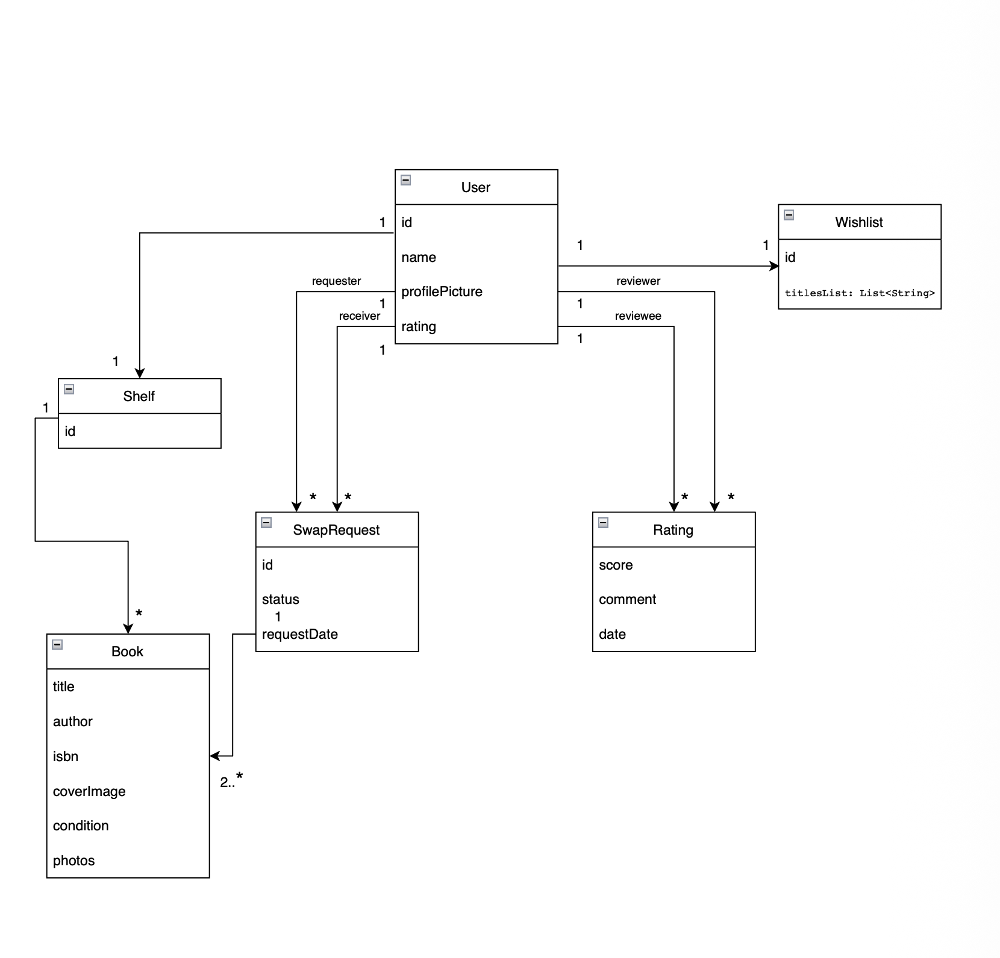

### User Interfaces

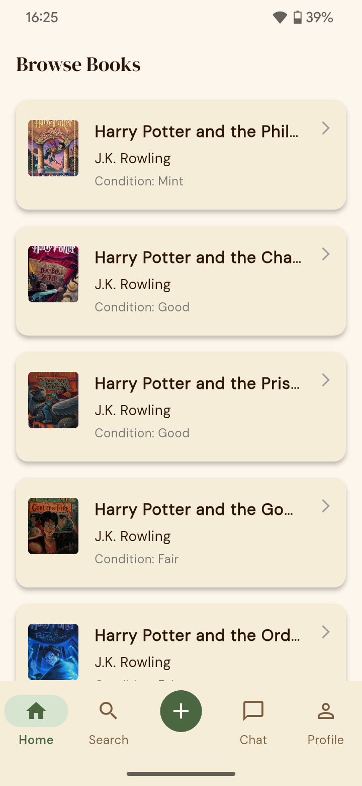

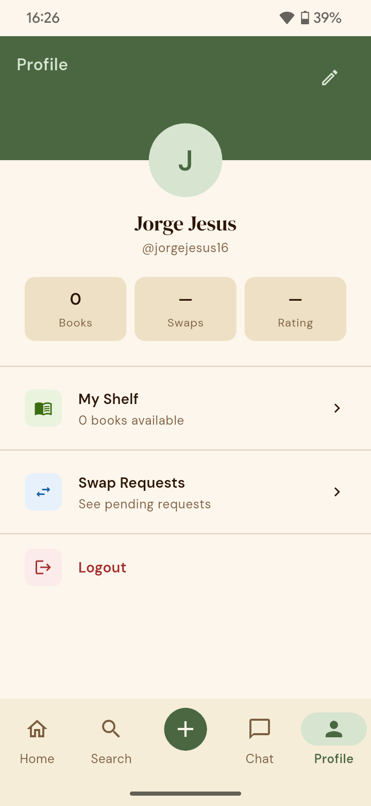
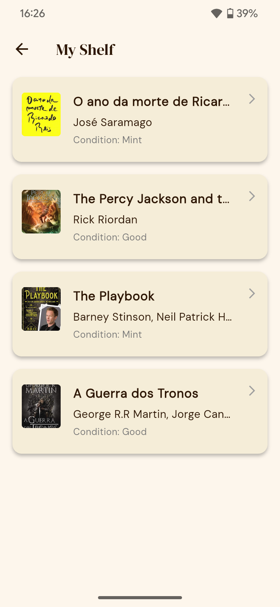

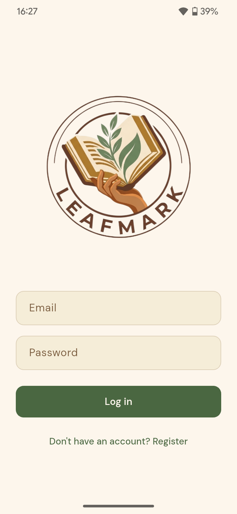

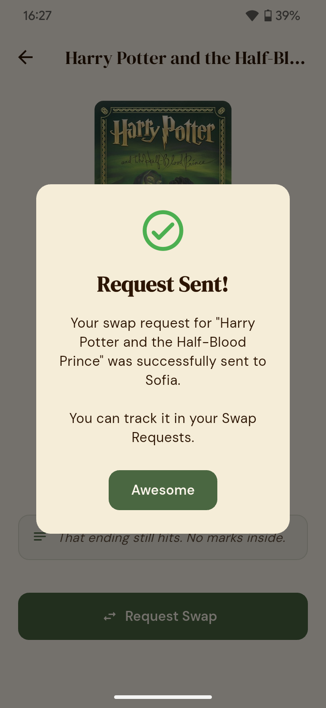
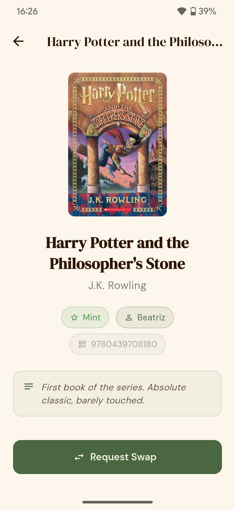

---

## Architecture and Design

### Logical Architecture

  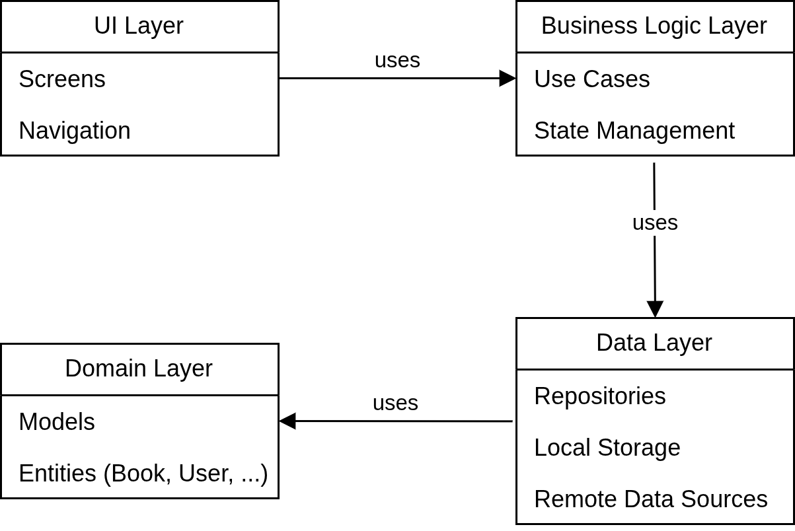

**Package Descriptions and Dependencies:**

- **UI Layer** — Responsible for user interaction: screens, widgets, navigation. Communicates with Business Logic.
- **Business Logic Layer** — Contains use cases and state management. Coordinates between UI and Data Layer.
- **Data Layer** — Handles data access and persistence. Uses Domain entities to structure the data.
- **Domain Layer** — Defines core entities like `Book`, `User`, `SwapRequest`. Independent layer; does not depend on any other layer.

**Dependencies (arrows in diagram):**
- UI → Business Logic (uses)
- Business Logic → Data (uses)
- Data → Domain (uses)

### Physical Architecture

  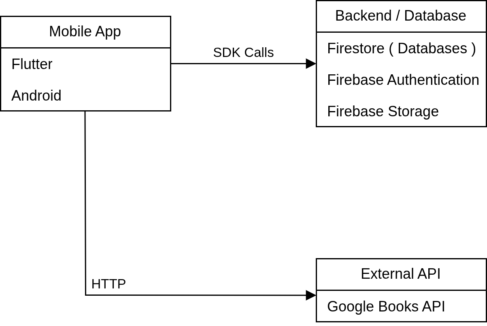

**Node Descriptions and Connections:**

- **Mobile App (Flutter)** — Client-side application running on Android (and eventually iOS). Handles UI, user interactions, and communication with backend and external API.
- **Firebase Backend** — Provides Firestore (database), Firebase Auth (authentication), Firebase Storage (book images). Fully managed, scalable.
- **Google Books API** — Retrieves book information from ISBN codes via HTTP.

**Connections:**
- Mobile App → Firebase: SDK calls
- Mobile App → Google Books API: HTTP requests

### Technology Justification

Flutter was chosen because it enables cross-platform mobile development with a single codebase, which is especially valuable for a small team of five developers working under tight sprint deadlines. It allows rapid iteration and consistent UI development across platforms.

Firebase was chosen as the backend for LeafMark because it provides a fully managed and scalable infrastructure without requiring server maintenance, reducing development overhead for a small team under tight sprint deadlines. Firebase Authentication handles user identity and trust in a community-driven platform. Firestore provides real-time data sync for shelves and swap requests, and Firebase Storage handles book cover images uploaded by users.

For the current prototype (Sprint 0), local storage is sufficient to demonstrate the core functionality. However, Firebase will support future features such as user accounts, swap requests, and real-time interactions between users.

Additionally, the Google Books API allows automatic retrieval of book data from ISBN codes, which is central to Leafmark’s core user flow and significantly simplifies the user experience.

### Functional Prototype

The functional prototype evolved across Sprint 0 and Sprint 1 to cover the full core interaction flow of LeafMark.

- Users can scan ISBN barcodes with the camera, fetching book information automatically from Google Books API.
- Books are added to a virtual shelf, browsable by other users, and searchable by title, author, or ISBN.
- Users can create accounts and authenticate securely via Firebase Auth.
- Swap requests can be initiated, accepted, or rejected; trades can be marked as "In Progress" or "Completed".
- All data is persisted in Firestore with book images stored in Firebase Storage.

---

## Project Management

* Backlog management: Product backlog and Sprint backlog in a [GitHub Projects board](#);
* Release management: [v0.1.0](../../releases/tag/v0.1.0), [v0.2.0](../../releases/tag/v0.2.0);
* Sprint planning and retrospectives:
    * **Plans**: screenshots of GitHub Projects board at the beginning and end of each Sprint;
    * **Retrospectives**: meeting notes addressing:
        * ✅ Did well — things we did well and should continue;
        * 🔁 Do differently — things we should change and how;
        * ❓ Puzzles — things we're unsure about;
        * 📌 Improvements to implement next Sprint;

### Sprint 0

#### Planning

Sprint 0 focused on establishing the project foundation: repository setup, architecture decisions, core prototype, and development workflow.

**Delivered:**
- ISBN barcode scanner with Google Books API integration
- `BookShelfProvider` with `shared_preferences` persistence
- `MyShelfScreen` with long-press-to-delete (bottom sheet + haptic feedback)
- `BrowseScreen` with 32 dummy books using OpenLibrary covers
- `BookDetailScreen` with condition chips, notes, and swap placeholder
- `MainScreen` navigation shell (2 tabs + FAB)
- GitHub Actions CI pipeline (analyze, test, build)
- Unit, integration, and acceptance test suites (0 failures)
- MoSCoW-labelled backlog with 19 user stories
- Git Flow branching with branch protection on `main` and `dev`

**Release:** [v0.1.0](../../releases/tag/v0.1.0)

#### Retrospective

✅ **Did well**
- Clean feature branch workflow with formal PR reviews kept `dev` stable throughout
- Survey-driven backlog reprioritization — security concerns surfaced early and shaped Must Have requirements correctly
- Provider architecture discipline: caught and fixed a silent double-registration bug during integration
- User survey (27 responses) conducted before Sprint 1 planning — findings directly reshaped the backlog, elevating security and trust features to Must Have

🔁 **Do differently**
- Start writing tests in parallel with features, not as a separate closing step
- Finalize visual identity earlier so UI decisions aren't blocked waiting on design direction

❓ **Puzzles**
- How to handle API key injection cleanly across all team members' environments without friction
- Whether to go platform-adaptive UI or consistent cross-platform look in Sprint 1

📌 **Improvements for Sprint 1**
- Implement real swap request flow (replace snackbar placeholder)
- Begin Firebase integration for user accounts
- Finalize app visual identity and design system
- Build trust/safety features: peer ratings, report flow

### Sprint 1

#### Planning

  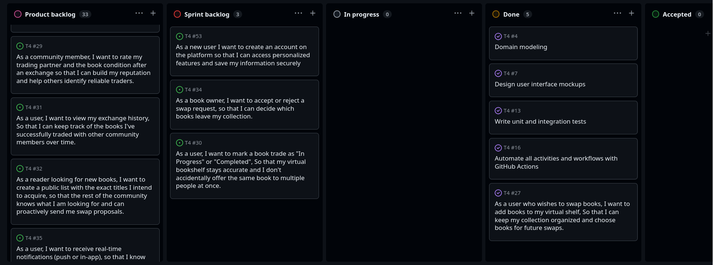

Sprint 1 focused on backend integration and core exchange features: user authentication, swap request management, and book discovery.

**Delivered:**
- User account creation and authentication via Firebase Auth
- Accept/reject swap requests as a book owner
- Trade status management ("In Progress" / "Completed")
- Search books by title, author, and ISBN
- Cached network images in `BookCard`
- Full migration from `shared_preferences` to Firebase (Firestore + Auth + Storage)
- UI enhancements across multiple screens

**Release:** [v0.2.0](../../releases/tag/v0.2.0)

#### Retrospective

  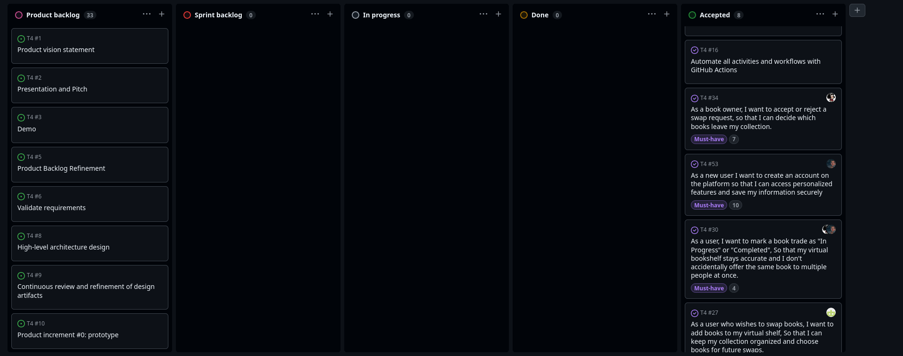

✅ **Did well**
- Successfully delivered all 3 Sprint backlog user stories
- Full Firebase migration completed within the sprint — no half-states left behind
- Search feature added beyond the original sprint scope

🔁 **Do differently**
- Start writing tests in parallel with features, not as a separate closing step

❓ **Puzzles**
- How to improve coordination across the team

📌 **Improvements for Sprint 2**
- Implement peer-to-peer reliability ratings
- Report malicious users flow
- In-app secure chat messaging

### Sprint 2

_[Add Sprint 2 planning screenshots and retrospective notes here.]_

### Sprint 3

_[Add Sprint 3 planning screenshots and retrospective notes here.]_

### Final Release

_[Describe the final release, linking to the release tag and summarising what was delivered.]_