# LeafMark Development Report

Welcome to the documentation of **LeafMark**!

This Software Development Report, tailored for LEIC-ES-2025-26, provides comprehensive details about **LeafMark**, a collaborative book-sharing mobile application, starting from a high-level vision and going into low-level implementation decisions.

It is organised by the following activities:

* [Business Modelling](#Business-Modelling)
    * [Product Vision](#Product-Vision)
    * [Features and Assumptions](#Features-and-Assumptions)
* [Requirements](#Requirements)
    * [User Stories](#User-Stories)
    * [Domain Model](#Domain-Model)
    * [User Interfaces](#User-Interfaces)
* [Architecture and Design](#Architecture-and-Design)
    * [Logical Architecture](#Logical-Architecture)
    * [Physical Architecture](#Physical-Architecture)
    * [Functional Prototype](#Functional-Prototype)
* [Setup](#Setup)
* [AI Usage](#AI-Usage)
* [Pitch](#Pitch)
* [Project Management](#Project-Management)
    * [Sprint 0](#Sprint-0)
    * [Sprint 1](#Sprint-1)
    * [Sprint 2](#Sprint-2)
    * [Sprint 3](#Sprint-3)
    * [Final Release](#Final-Release)

Contributions are expected to be made exclusively by the initial team, but we may open them to the community, after the course, in all areas and topics: requirements, technologies, development, experimentation, testing, etc.

Please contact us!

Thank you!

* David Pinto - up202404233@up.pt
* Diogo Quaresma - up202406470@up.pt
* João Lage - up202406458@up.pt
* Luís Torrão - up202406471@up.pt
* Mafalda Pacheco - up202406162@up.pt

---

## Business Modelling

Business modeling in software development involves defining the product's vision, understanding market needs, aligning features with user expectations, and setting the groundwork for strategic planning and execution.

### Product Vision

Leafmark is a community-driven book exchange platform that makes trading books between readers effortless, affordable, and sustainable.

### Features and Assumptions

**Features:**
- **ISBN Barcode Scanning** — scan a book's barcode with the camera to auto-fill title, author, and cover via Google Books API
- **Personal Shelf Management** — add books to a virtual shelf, view the collection, and remove books with a long-press gesture
- **Community Browsing** — explore books listed by other users with cover images and condition details
- **Book Search** — search books by title, author, or ISBN
- **Book Detail View** — inspect any book's full metadata, condition, owner, and notes
- **Swap Request Management** — initiate, accept, or reject trade proposals; mark trades as "In Progress" or "Completed"
- **User Accounts** — create an account and authenticate securely via Firebase Auth
- **Cloud Persistence** — all application data is stored in Firestore; book condition photos are uploaded through Cloudinary
- **In-App Secure Chat** — negotiate swaps through real-time messaging, proposals and counter-offers
- **Ratings & Reviews** — rate trading partners and book condition after completed exchanges
- **User Search** — search community members by username or display name
- **Follow Readers** — follow other readers and discover their collections
- **User Blocking** — block unwanted users and prevent future interactions
- **Notifications** — receive in-app notifications for messages, swaps and interactions
- **Wishlist Management** — maintain a list of books you would like to acquire
- **Exchange History** — track completed book exchanges
- **Profile Badges** — earn credibility badges based on community activity
- **Real Book Photos** — upload photos showing the actual condition of books
- **Dark Mode** — complete application-wide theming support for dark and light modes
- **Profile Sharing** — share links to your public or private profile externally
- **Account Management** — comprehensive privacy controls including secure account deletion
- **Edit Books** — edit details of books already present on your shelf

**Assumptions:**
- Users have an Android device with a working camera for ISBN scanning
- Google Books API is available and returns results for standard ISBN-10 and ISBN-13 codes; OpenLibrary is used as a cover fallback
- Firebase services (Auth, Firestore) are available and correctly configured. Storage is done through Cloudinary.

---

## Requirements

### User Stories
* **ISBN Barcode Scanning**: As a user with many books to add, I want to scan the barcode (ISBN) of a physical book using my camera, So that the book details (title, author, cover) are filled in automatically.
* **Initiating a Trade Request**: As a borrower, I want to propose a "swap" (my Book A for your Book B), so that we can reach a mutual agreement on the value of the trade.
* **Personal Catalog Organization**: As a user who wishes to swap books, I want to add books to my virtual shelf, so that I can keep my collection organized and choose books for future swaps.
* **Community Browsing**: As a user, I want to browse books available from other users so that I can find books I'd like to acquire.

### User Research

A survey was conducted to validate assumptions and inform backlog prioritisation before Sprint 1 development began.

**Survey Form:** [LeafMark User Research Survey](https://forms.gle/K4Gx3MkjVauMX4H49)

**27 responses** were collected from potential users. Key findings:

- **100%** had previously exchanged books informally, confirming real demand for a structured platform
- **Cost** was the primary motivation for using a book trading platform over buying new
- **Peer ratings** emerged as the main trust mechanism users expected before agreeing to a swap
- **Security concerns** were identified as the biggest adoption barrier

Based on this feedback, the following backlog changes were made:
- **Peer-to-Peer Reliability Rating**, **Report Malicious Users**, and **In-App Secure Chat Messaging** were elevated to **Must Have**
- **Blind Date with a Book** was moved from **Could Have** to **Should Have**

### Survey Results

<div align="center">

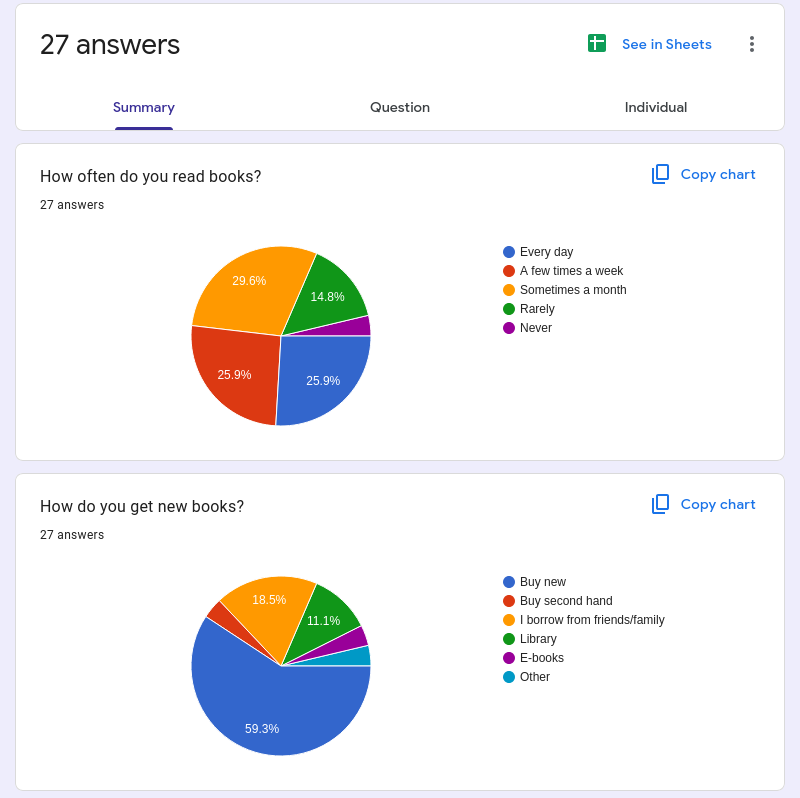
<p><em>Survey result 1</em></p>

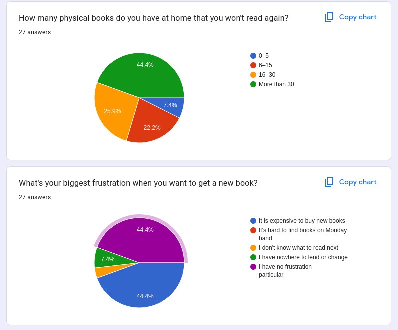
<p><em>Survey result 2</em></p>

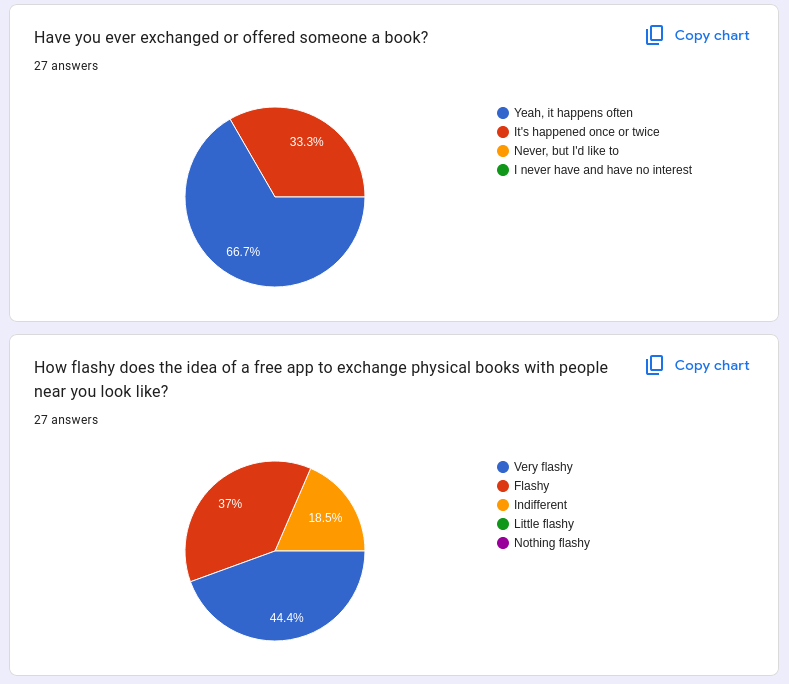
<p><em>Survey result 3</em></p>

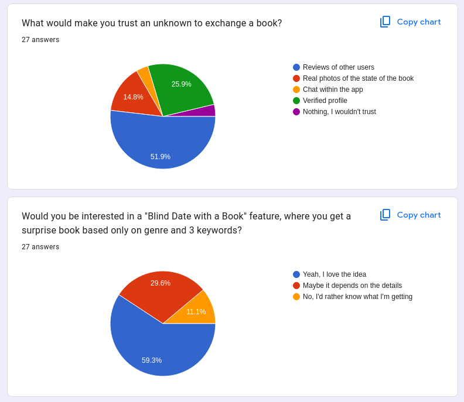
<p><em>Survey result 4</em></p>

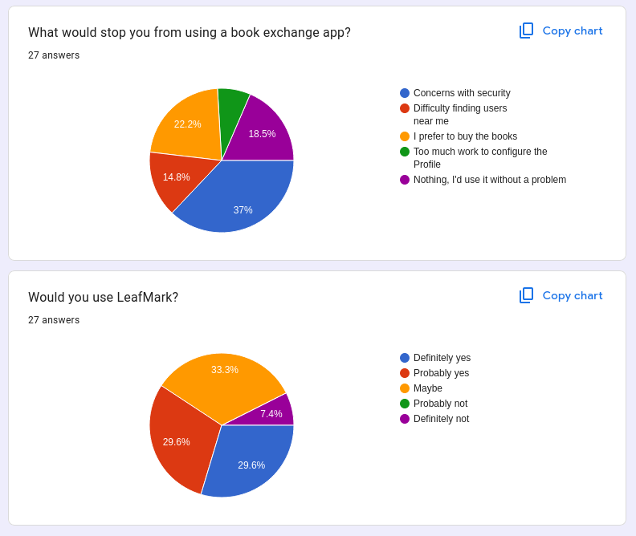
<p><em>Survey result 5</em></p>

</div>

The survey results directly influenced backlog prioritisation and feature planning decisions throughout the project.

### Domain Model

* **User**: A member of the LeafMark community who maintains a profile, tracks their rating, and manages their personal book collections.
* **Book**: A physical item defined by its title, author, and ISBN. It includes metadata such as current condition and photos to facilitate fair trading.
* **Shelf**: A collection belonging to a specific user that contains the books they currently own and are available for exchange.
* **SwapRequest**: A proposal between two users that manages the full exchange lifecycle, from initial request and negotiation to completion, ownership transfer and post-exchange rating.
* **Wishlist**: A personal list belonging to a user that contains the titles of books they are actively looking to acquire.
* **Rating**: A feedback mechanism where one user evaluates another after a trade is completed to maintain community trust.


### User Interfaces

The following screenshots and promotional visuals showcase the final state of LeafMark (v1.0.0).

## Product Showcase

<div align="center">

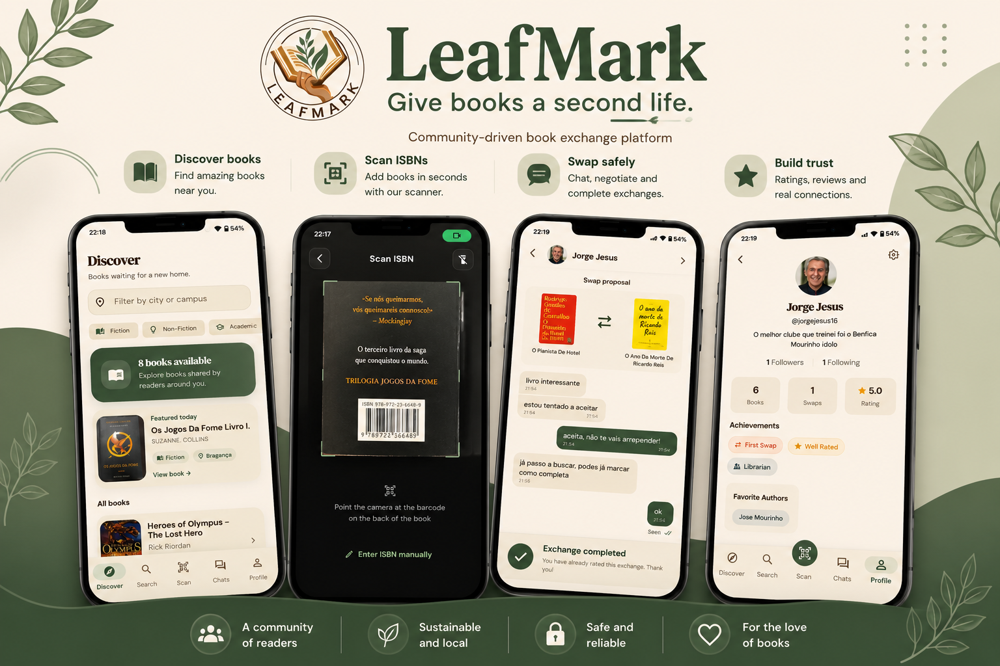

</div>

<div align="center">

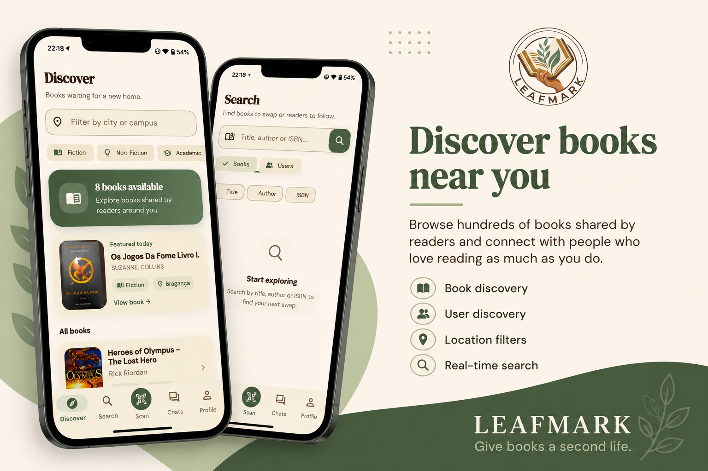
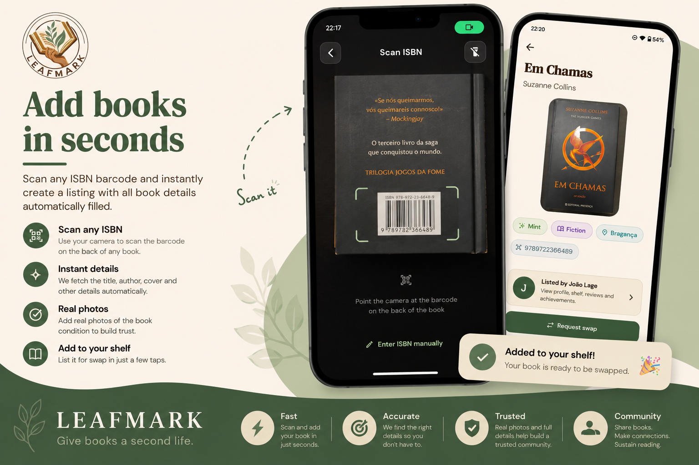

</div>

<div align="center">

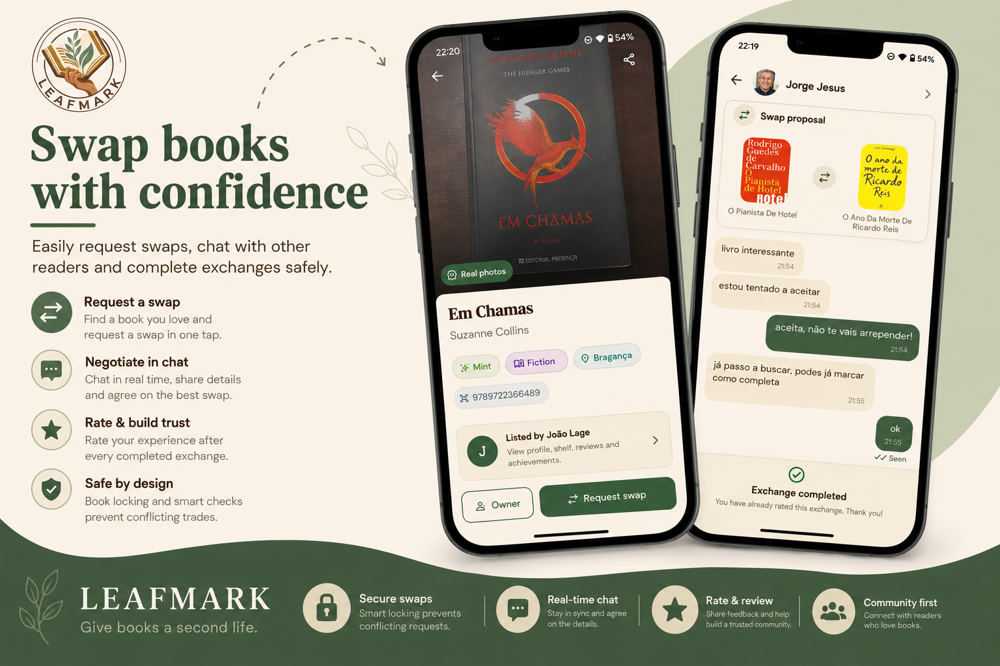
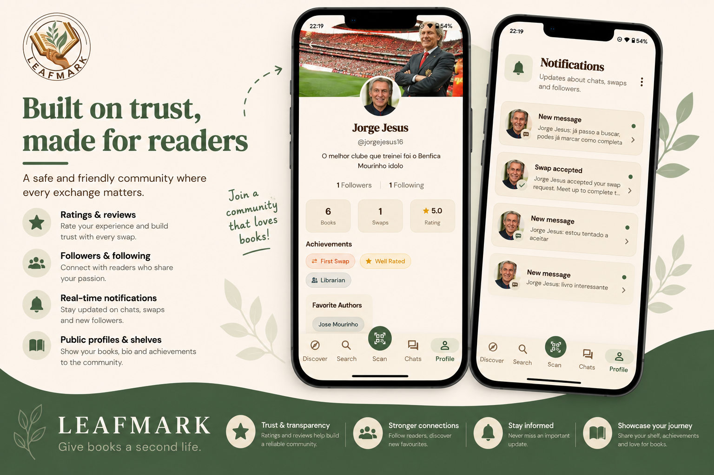

</div>

<div align="center">

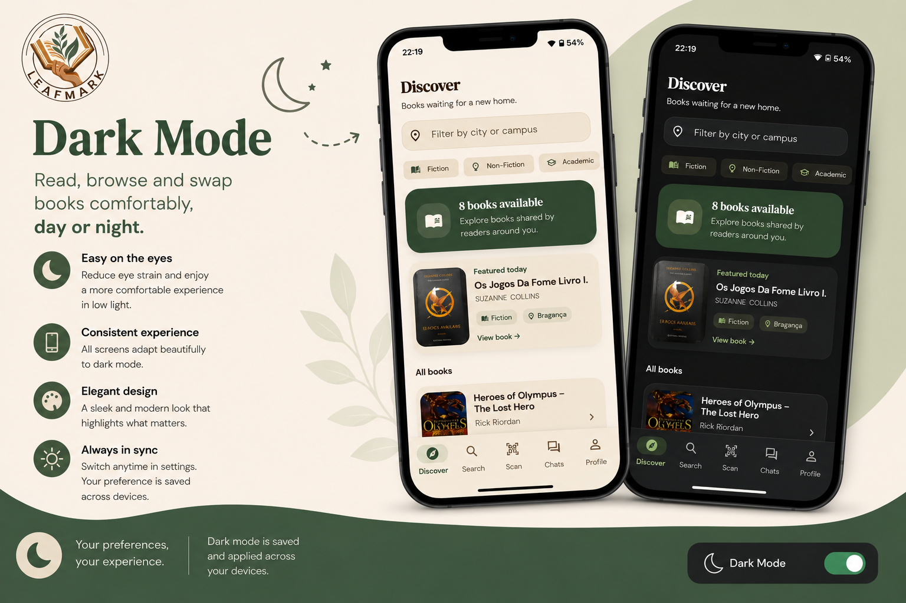

</div>

---

## Architecture and Design

### Logical Architecture

<p align="center">
  
</p>

**Package Descriptions and Dependencies:**

- **UI Layer** — Responsible for user interaction: screens, widgets, navigation. Communicates with Business Logic.
- **Business Logic Layer** — Contains providers and state management. Handles all application logic and Firebase communication.
- **Domain Layer** — Defines core entities like `Book`, `User`, `SwapRequest`, `Report`. Independent layer; does not depend on any other layer.

**Dependencies (arrows in diagram):**
- UI → Business Logic (uses)
- Business Logic → Domain (uses)

### Physical Architecture

<p align="center">
  
</p>

**Node Descriptions and Connections:**

- **Mobile App (Flutter)** — Client-side application running on Android (and eventually iOS). Handles UI, user interactions, and communication with backend and external API.
- **Firebase Backend** — Provides Firestore (database), Firebase Auth (authentication), notifications and real-time application data.
- **Google Books API** — Retrieves book information from ISBN codes via HTTP.
- **Cloudinary** — Stores user-uploaded book condition photos.

**Connections:**
- Mobile App → Firebase: SDK calls
- Mobile App → Google Books API: HTTP requests
- Mobile App → Cloudinary: image uploads and retrieval

### Technology Justification

Flutter was chosen because it enables cross-platform mobile development with a single codebase, which is especially valuable for a small team of five developers working under tight sprint deadlines. It allows rapid iteration and consistent UI development across platforms.

Firebase was chosen as the backend for LeafMark because it provides a fully managed and scalable infrastructure without requiring server maintenance, reducing development overhead for a small team under tight sprint deadlines. Firebase Authentication handles user identity and trust in a community-driven platform. Firestore provides real-time data sync for shelves and swap requests. Cloudinary was chosen to store user-uploaded book condition photos because it provides a generous free tier, image optimization capabilities and avoids the costs associated with Firebase Storage.

For the current prototype (Sprint 0), local storage is sufficient to demonstrate the core functionality. However, Firebase will support future features such as user accounts, swap requests, and real-time interactions between users.

Additionally, the Google Books API allows automatic retrieval of book data from ISBN codes, which is central to Leafmark's core user flow and significantly simplifies the user experience.

### Functional Prototype

The functional prototype evolved across the entire development cycle to cover the full core interaction flow of LeafMark.

- User authentication and comprehensive profile management (including secure account deletion)
- ISBN barcode scanning using Google Books API with automatic Title Case formatting
- Personal shelf management (add, edit, and delete books)
- Community browsing with category and location filters
- Search books and users across the platform
- Real book condition photos uploaded to Cloudinary
- Swap proposals, counter-offers, and automatic resolution of conflicting swaps
- Real-time chat integration for smooth negotiations
- Follow/unfollow readers and view followers
- User blocking and privacy controls
- In-app notifications
- Detailed exchange history and ownership transfer
- Ratings and reviews
- User reporting
- Wishlist management
- Profile badges
- Application-wide Dark Mode support with dynamic theming

---

## Setup

Everything you need to run LeafMark locally after cloning the repo.

### Prerequisites

- [Flutter SDK](https://docs.flutter.dev/get-started/install) (version matching `pubspec.yaml`)
- Android Studio with an Android emulator (API 21+), or a physical Android device
- A Firebase project with Firestore and Auth enabled
- A Cloudinary account for image uploads
- A Google Books API key

### 1. Clone the repo and install dependencies

```bash
git clone https://github.com/LEIC-ES-2025-26-2LEIC14/T4.git
cd T4
flutter pub get
```

### 2. Firebase configuration

`firebase_options.dart` and `google-services.json` are committed and do not need to be recreated. 

### 3. Google Books API key

Create a file called `.env` in the root of the project (same folder as `pubspec.yaml`):

```
GOOGLE_BOOKS_API_KEY=your_key_here
```

The `.env` file is in `.gitignore` and must never be committed. Each team member uses their own key. To get one:

1. Go to [console.cloud.google.com](https://console.cloud.google.com)
2. Create or select a project
3. Go to **APIs & Services → Library**, search for **Books API** and enable it
4. Go to **APIs & Services → Credentials → Create Credentials → API Key**
5. Copy the key into your `.env`

### 4. Run the app

Always run with `--dart-define-from-file` so the API key is injected:

```bash
flutter run --dart-define-from-file=.env
```

If you use the Android Studio **▶️ button**, add this to **Edit Configurations → Additional run args**:

```
--dart-define-from-file=.env
```

### 5. Run the tests

```bash
flutter test
```

No additional setup needed — tests use `FakeFirebaseFirestore` and do not hit real Firebase.

---

## AI Usage

All five team members used AI assistants during development. The tools used were **Claude** (primary), **Gemini**, **ChatGPT** and **Perplexity**.

Claude was used the most, mainly for implementation guidance, architecture decisions, code review, and writing documentation. Gemini and ChatGPT were used for occasional second opinions on Flutter-specific questions. Perplexity was used mostly for quick lookups and research.

AI was never used to blindly generate and commit code. Every suggestion was read, understood, and adapted to the project's architecture before being used. We treated the tools as a fast way to explore options, not as a replacement for thinking through the problem first.

A full log of AI interactions is available in [`docs/ai_usage_log.md`](docs/ai_usage_log.md).

---

## Pitch

### The Problem

Think about the last time you finished a great book. What did you do with it? For most people, it goes on a shelf and is never opened again. Meanwhile, millions of readers are buying new copies of books that are sitting unused in someone else's home, a few streets away. Book trading has always happened informally — among friends, in Facebook groups, at flea markets — but it's slow, unstructured, and, most importantly, it lacks trust. Our own user research, with 27 respondents, confirmed this: 100% had already tried to exchange books informally, but security concerns were identified as the single biggest barrier stopping people from doing it more.

### Our Solution

That's why we built **LeafMark**, a mobile app that turns book exchange into something effortless, affordable, and safe. With LeafMark, you scan a book's barcode and it's instantly added to your virtual shelf, complete with title, author, and cover. You browse what your community has to offer, propose a swap, negotiate through in-app chat, and once you agree, ownership transfers automatically when the exchange is completed. No middleman, no wasted books, no new spending, just readers trading with readers.

### Our Unique Selling Points

What sets LeafMark apart isn't just that it lets people swap books, it's that we built trust into every layer of the app. Peer ratings, user reporting, and blocking give the community real safety tools, directly because our survey told us that's what people needed most before they'd trust a stranger with a trade. Real condition photos remove the guesswork of buying second-hand. And our real-time chat, with proposals and counter-offers, means negotiation happens where the trade happens, not in a separate app or a comment thread.

### Engaging the Audience

So let me ask you this: how many books do you have on your shelf right now that you've already read, and will probably never open again? Now imagine trading each one for something new to read — for **free**. That's LeafMark.

### Visuals

The pitch was accompanied by our Google Slides deck (linked on Moodle), showcasing the app's UI, from ISBN scanning to the chat and swap flow, alongside screenshots and the LeafMark product showcase visuals also found in this README.

---

## Project Management

* Backlog management: Product backlog and Sprint backlog in a [GitHub Projects board](#);
* Release management: [v0.1.0](../../releases/tag/v0.1.0), [v0.2.0](../../releases/tag/v0.2.0), [v0.3.0](../../releases/tag/v0.3.0), [v0.4.0](../../releases/tag/v0.4.0), [v1.0.0](../../releases/tag/v1.0.0);
* Sprint planning and retrospectives:
    * **Plans**: screenshots of GitHub Projects board at the beginning and end of each Sprint;
    * **Retrospectives**: meeting notes addressing:
        * ✅ Did well — things we did well and should continue;
        * 🔁 Do differently — things we should change and how;
        * ❓ Puzzles — things we're unsure about;
        * 📌 Improvements to implement next Sprint;

### Sprint 0

#### Planning

Sprint 0 focused on establishing the project foundation: repository setup, architecture decisions, core prototype, and development workflow.

**Delivered:**
- ISBN barcode scanner with Google Books API integration
- `BookShelfProvider` with `shared_preferences` persistence
- `MyShelfScreen` with long-press-to-delete (bottom sheet + haptic feedback)
- `BrowseScreen` with 32 dummy books using OpenLibrary covers
- `BookDetailScreen` with condition chips, notes, and swap placeholder
- `MainScreen` navigation shell (2 tabs + FAB)
- GitHub Actions CI pipeline (analyze, test, build)
- Unit, integration, and acceptance test suites (0 failures)
- MoSCoW-labelled backlog with 19 user stories
- Git Flow branching with branch protection on `main` and `dev`

**Release:** [v0.1.0](../../releases/tag/v0.1.0)

#### Retrospective

✅ **Did well**
- Clean feature branch workflow with formal PR reviews kept `dev` stable throughout
- Survey-driven backlog reprioritization — security concerns surfaced early and shaped Must Have requirements correctly
- Provider architecture discipline: caught and fixed a silent double-registration bug during integration
- User survey (27 responses) conducted before Sprint 1 planning — findings directly reshaped the backlog, elevating security and trust features to Must Have

🔁 **Do differently**
- Start writing tests in parallel with features, not as a separate closing step
- Finalize visual identity earlier so UI decisions aren't blocked waiting on design direction

❓ **Puzzles**
- How to handle API key injection cleanly across all team members' environments without friction
- Whether to go platform-adaptive UI or consistent cross-platform look in Sprint 1

📌 **Improvements for Sprint 1**
- Implement real swap request flow (replace snackbar placeholder)
- Begin Firebase integration for user accounts
- Finalize app visual identity and design system
- Build trust/safety features: peer ratings, report flow

### Sprint 1

#### Planning

<p align="center">
  
</p>

Sprint 1 focused on backend integration and core exchange features: user authentication, swap request management, and book discovery.

**Delivered:**
- User account creation and authentication via Firebase Auth
- Accept/reject swap requests as a book owner
- Trade status management ("In Progress" / "Completed")
- Search books by title, author, and ISBN
- Cached network images in `BookCard`
- Full migration from `shared_preferences` to Firebase (Firestore + Auth + Storage)
- UI enhancements across multiple screens

**Release:** [v0.2.0](../../releases/tag/v0.2.0)

#### Retrospective

<p align="center">
  
</p>

✅ **Did well**
- Successfully delivered all 3 Sprint backlog user stories
- Full Firebase migration completed within the sprint — no half-states left behind
- Search feature added beyond the original sprint scope

🔁 **Do differently**
- Start writing tests in parallel with features, not as a separate closing step

❓ **Puzzles**
- How to improve coordination across the team

📌 **Improvements for Sprint 2**
- Implement peer-to-peer reliability ratings
- Report malicious users flow
- In-app secure chat messaging

### Sprint 2

#### Planning

<p align="center">
  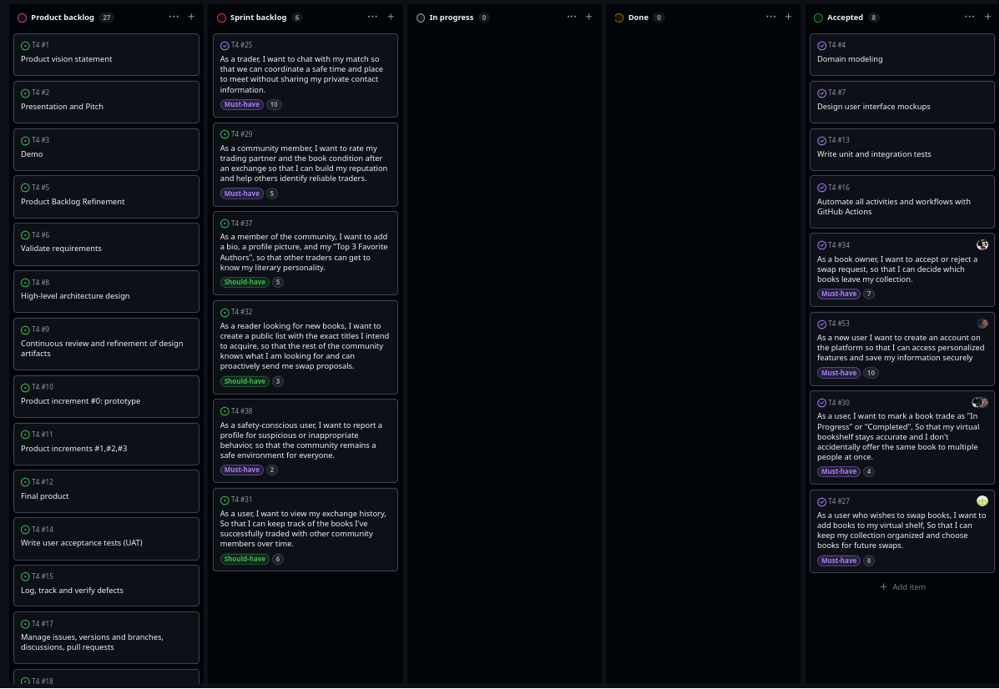
</p>

Sprint 2 tackled the features that were missing for the app to feel real: chat, ratings, user profiles with actual content, and safety tools. We also cleared out all the dummy data — BrowseScreen and SwapRequestsScreen now read from Firestore.

**Delivered:**
- In-app chat with swap proposals, counter-offers, typing indicators and read receipts
- `ChatListScreen` as the inbox in the Chat tab
- Book picker bottom sheet before creating a swap
- `PublicProfileScreen` reachable from any chat
- Profile bio, photo and Top 3 Favourite Authors, with a new `EditProfileScreen`
- Partner and book condition ratings after a completed swap, with a guard against double submission
- Exchange history listing completed swaps with cover, title, partner and date
- Report profile — flag users via a bottom sheet (Spam / Inappropriate behaviour / Fake account / Other)
- Public wishlist, visible in read-only mode on `PublicProfileScreen`
- `BrowseScreen` and `SwapRequestsScreen` fully migrated from dummy data to Firestore
- Unit tests for `WishlistService` and `RatingService` with `FakeFirebaseFirestore`
- UATs for the rating flow and exchange history

**Release:** [v0.3.0](../../releases/tag/v0.3.0)

#### Retrospective

<p align="center">
  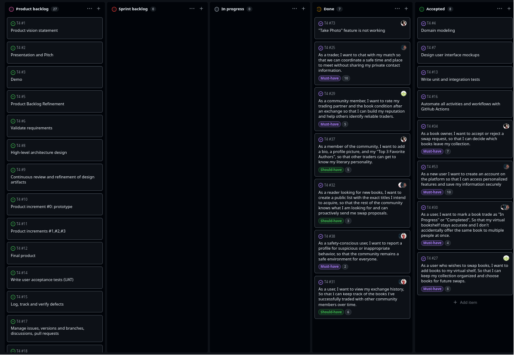
</p>

✅ **Did well**
- Delivered every Must Have and Should Have story in the sprint
- Dummy data is gone — the app talks to real Firestore data end to end
- The chat system (proposals, counter-offers, typing, read receipts) was the most complex feature so far and shipped cleanly
- Started creating GitHub Issues for bugs found during development instead of fixing them silently — makes the work visible and traceable
- Security rules extended to cover every new collection added this sprint

🔁 **Do differently**
- Better time management per feature — some stories took longer than expected and compressed the end of the sprint
- Avoid starting two features at the same time when they touch the same files; we had merge conflicts that cost time and could have been avoided with a quick heads-up first

❓ **Puzzles**
- How `collectionGroup` queries will behave at scale — worth keeping an eye on read costs as the user base grows
- Offline behaviour with real-time chat: what should the app show when there's no connection?

📌 **Improvements for Sprint 3**
- Filters on `BrowseScreen` (deferred twice now — has to ship)
- Search UX redesign — currently surfaces books as swap listings, not as a discovery tool
- Automate GitHub Release uploads once org permissions are sorted

### Sprint 3

#### Planning

<p align="center">
  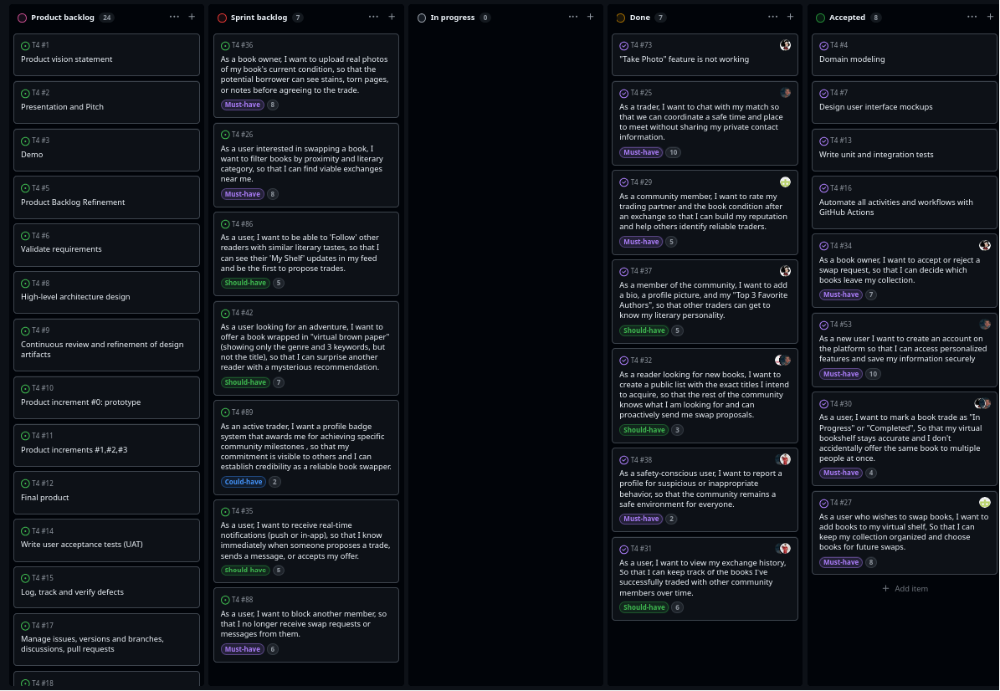
</p>

Sprint 3 focused on improving trust, safety, discoverability, and exchange reliability. The goal was to move LeafMark beyond a functional prototype and closer to a real-world book exchange platform by introducing safety controls, richer user interactions, and a complete exchange workflow.

**Delivered:**

* Real book condition photos with Cloudinary integration
* Browse filters by category and location
* User blocking system
* Follow and unfollow readers
* In-app real-time notifications
* Profile badges
* User search by username and display name
* Search screen redesign with Books / Users mode
* Book detail screen redesign with marketplace-style layout
* Complete physical exchange workflow
* Automatic ownership transfer after completed exchanges
* Book locking system to prevent conflicting swaps
* Improved exchange history
* Improved public profile statistics
* Expanded automated test coverage
* Multiple Firestore security rule improvements
* Bug fixes #95 and #96

**Not Delivered:**

* Virtual Brown Paper (#42)

The team intentionally prioritised application stability, testing quality, and completion of the exchange workflow over implementing the remaining stretch feature.

**Release:** [v0.4.0](../../releases/tag/v0.4.0)

#### Retrospective

<p align="center">
  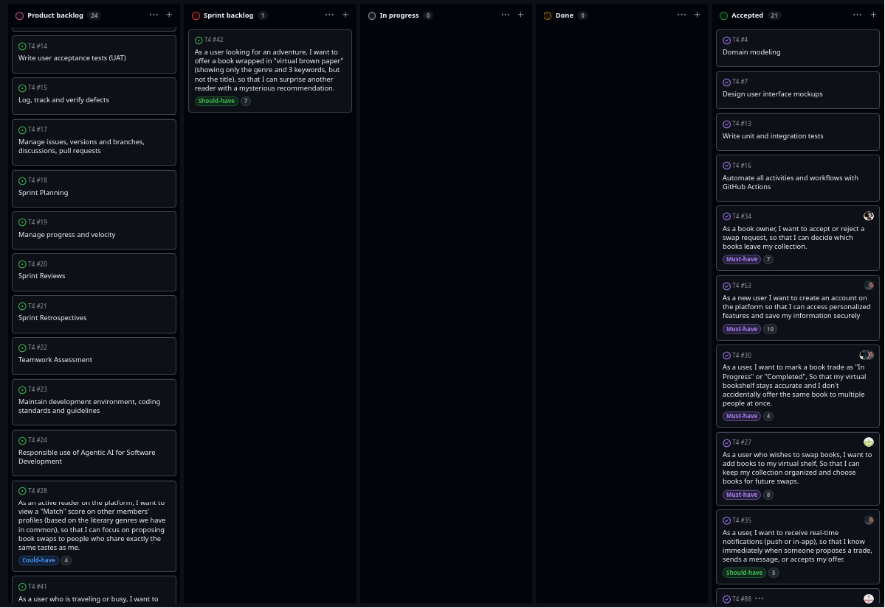
</p>

✅ **Did well**

* Delivered all planned Must Have stories
* Delivered all planned Should Have stories except one stretch feature
* Implemented several features beyond the original sprint scope, including user search and ownership transfer
* Completed the full end-to-end exchange workflow from proposal to ownership transfer
* Significantly expanded automated testing coverage
* Improved overall application stability and security
* Continued improving Firestore rules and backend consistency

🔁 **Do differently**

* Define complex workflow requirements earlier to reduce late-stage integration work
* Continue writing tests alongside implementation instead of concentrating them near the end of the sprint
* Reduce the amount of UI redesign work performed during feature implementation

❓ **Puzzles**

* How recommendation and discovery systems should evolve in future releases
* Whether notifications should eventually be extended with Firebase Cloud Messaging
* How to scale user discovery while keeping browse results relevant

📌 **Improvements for Final Release**

* Implement the remaining Virtual Brown Paper feature and other user stories
* Continue expanding automated test coverage
* Improve recommendation and discovery capabilities
* Polish UI and user experience for the final release
* Address any remaining bugs and technical debt


### Final Release

#### Planning

The Final Release was dedicated to polishing the user experience, enhancing privacy controls, addressing technical debt, and providing complete theming support before the final submission.

**Delivered:**
- Application-wide Dark Mode support with dynamic theme toggling
- Secure account deletion workflow to permanently remove user and associated data
- Profile-sharing functionality on both private and public profile pages
- Dedicated "Followers" screen
- "Edit Book" screen allowing users to modify details of books already on their shelf
- Automatic cancellation of conflicting pending swap requests when a book becomes locked
- Title case formatting for book titles parsed from barcode scans and external sources
- Major UI redesign and UX enhancements across multiple screens
- Resolved data integrity issues and orphaned resource leaks upon account deletion
- Updated Firestore security rules for granular permission control

**Release:** [v1.0.0](../../releases/tag/v1.0.0)

#### Retrospective

✅ **Did well**
- Successfully implemented full Dark Mode support, which was a highly requested feature
- Handled edge cases regarding data consistency during account deletion effectively
- Cleaned up the user interface with cohesive theming and improved animations
- Proactively addressed potential state conflicts during complex swap scenarios

🔁 **Do differently**
- Plan for theming and dark mode from the beginning of the project to avoid massive UI refactoring later
- Dedicate more time for comprehensive beta testing before the final release to catch minor UI bugs

❓ **Puzzles**
- How to best handle legacy data (e.g., chats) when one of the participants completely deletes their account
- How to seamlessly integrate native push notifications in a purely Flutter-based architecture without relying heavily on platform-specific code

📌 **Future Work**
- Implement an AI-driven recommendation feed for book discovery
- Introduce native push notifications via Firebase Cloud Messaging
- Support for physical meet-up locations using Maps integration
- Implement the "Virtual Brown Paper" feature for community discussions